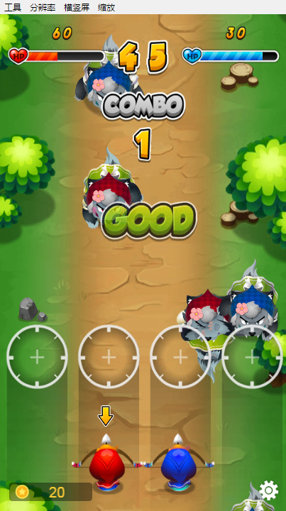
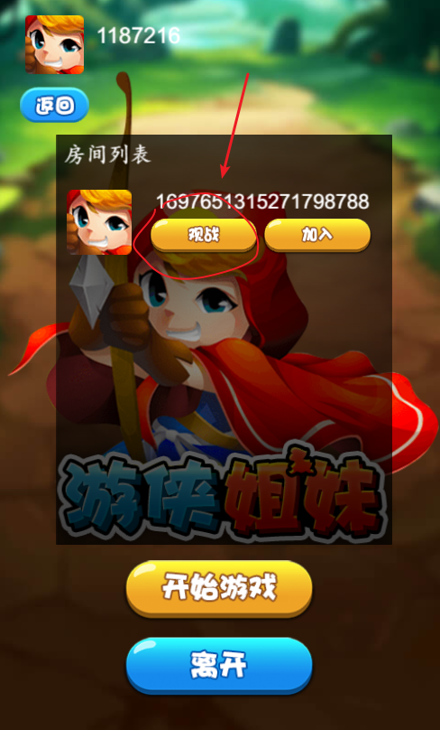

### 游戏简介:

玩法类似节奏大师

游戏中，在屏幕中的大灰狼走到游侠姐妹的弓箭准星之中时，点击对应的准星进行射击，打中大灰狼加分。
大灰狼冲过底线则会扣除生命值。
随着游戏进行，大灰狼的前进速度将越来越快。在本局时间结束后，分数高的一方将获胜。

###  游戏指引

多人玩法体验: 此游戏为联网对战游戏. 测试完整游戏流程需要两台手机和两个微信帐号,并同时进行多人对战.

单人玩法体验: 首页点击 `?` 按钮,体验单机模式

可以对正在进行的游戏进行观战.观战方的画面滞后于正在进行的游戏若干秒.[观战直播功能的详细说明](https://matchvs.com/service?page=live)

### 体验地址

H5体验地址:http://demo.matchvs.com/Ranger

微信小游戏体验地址:

### ChangeLog

- v1.2.0 2018-11-01

	- 增加观战功能

- v1.1.0 2018-07-24

	- 重新策划游戏玩法,大幅提升可玩性.增加音效

	- 使用eui和assetsmanager重构项目.去除大量全局变量.减少约50%代码.

	- 游戏引擎升级到egret5.2.4, 

- v1.0.0 2018-06-07

	- 新增登录进度条,优化用户体验

	- 修复微信且后台后不能继续匹配的问题

	- 优化帐号登录注册流程

	- 修复大厅界面不能返回的问题 
